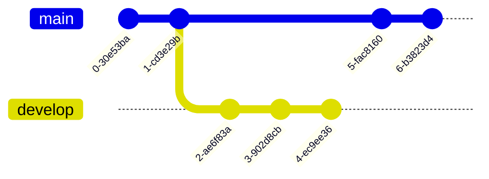

# pagina 1
industrial revolution and its consequences 
## titulo nivel 2

### titulo nivel 3

have been a disaster to human race

#### titulo 4
####### titulo 7 (esto ya es un parrafo normal)

dentro del parrafo *esto* esto esta en cursiva **esto** esta en negrita y ***estoo*** en cursiva y neggriata

- esto es una liosta no ordenada
- esto es otro elemento de la lista
- esto es otro elemento mas
  - esto es un elemento anidado
  
1. lista numerada
   - tambien se puede hacer esto, claramente
2. lista numerada 2
3. va fino
    1. padentro
       1. padenrto mas

4. ultimo elemento

- [ ] tarea 1
- [x] tarea 2

> Industrial revoluctrion and its consequences have been a disaster for the human race
> > cita anidada
> 
>se puede hacer mucha tonrteria aqui
> - otra cita mas


toma Java POW:
```java
public class HolaMundo{
    public static void main
    (String[] args){
        system.out.println("Hola Mundo");
    }
}
```

```bash 
git init
git add .
git commit -m "Mi primer 
commit"
```


[Principio de la pagina](#pagina-1)

:smile:
:lobster:
🦞

para saltarnos el este \*\*negrita\*\*

| encabezado 1 | ENVCABEZADO 2 | encabeazadso 3 | encabezado 4 | encabezado 5 |
| ------------ | ------------- | -------------- | ------------ | ------------ |
| celda 11 | celda 12 | celda 13 | tuqui | taca |

Diagramas:



formula de la relatividaad:
$e=mc²$

$$F = g \frac{m_1 m_2}{d²}$$